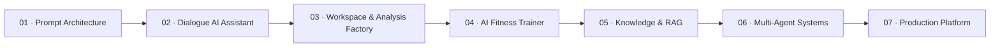

<div align="center">

# DEVELOPER OF AI AGENTS

### Course Portfolio · Agent Architecture · Reusable AI Systems

**From prompt engineering to production-oriented agent platforms**

[](#карта-курса)
[](#проекты)
[](#архитектурная-линия)
[](./00_STANDARDS/)

**Единый инженерный репозиторий курса «Разработчик AI-агентов».**

</div>

---

## О репозитории

Это не набор разрозненных домашних работ, а последовательное портфолио проектов, в котором каждый новый этап курса расширяет общую архитектуру.

Репозиторий объединяет:

- учебные задания и рабочие прототипы;
- AI-ассистентов с веб-интерфейсом;
- структурированные промпты и валидируемый output;
- общую память, документы и Workspace;
- аналитические и отчётные модули;
- безопасность, журналирование и инженерную документацию;
- машиночитаемые стандарты для повторного использования решений агентами.

> **Главный принцип:** каждый следующий проект опирается на уже реализованные компоненты и решения, а не начинается с нуля.

---

## Карта курса



Каждый модуль курса добавляет новый слой:

| Этап | Фокус | Повторно используемый результат |
|---|---|---|
| 01 | Промпт-архитектура | Инструкции, ограничения, циклы уточнения |
| 02 | Диалоговый AI | История сообщений, API, аналитика, PDF |
| 03 | Workspace | Единый контекст документов и диалогов |
| 04 | AI-фитнес-тренер | Прогноз, события, safety rules, mock devices |
| 05+ | Следующие темы курса | RAG, инструменты, оркестрация, production |

---

## Проекты

| № | Проект | Ключевой результат | Статус |
|---:|---|---|---|
| 02 | [MONGOOSE AI PLATFORM](./projects/02-dialogue-ai-assistant/) | Диалог, Professional Assessment, Analysis Factory, PDF Reports | Release Candidate |
| 04 | [PULSE CARE AI](./projects/04-ai-fitness-trainer/) | AI-фитнес-тренер, прогноз достижения целей, Synthetic Demo, агентная модель | В разработке |

Новые проекты добавляются в каталог `projects/` и регистрируются в машиночитаемом индексе курса.

---

## Архитектурная линия

```text
User Interfaces
Web · Mobile · Telegram · CRM · External API
                         │
                         ▼
                  Agent Gateway
                         │
                         ▼
                 Shared Workspace
       Messages · Documents · Goals · Events
                         │
       ┌─────────────────┼─────────────────┐
       │                 │                 │
       ▼                 ▼                 ▼
 Dialogue Agent    Analysis Agents    Domain Agents
       │                 │                 │
       └─────────────────┼─────────────────┘
                         ▼
              Safety & Policy Layer
                         │
                         ▼
          Tools · Knowledge · Reports · APIs
```

Основные принципы:

- **Workspace first** — контекст пользователя, документов и событий хранится централизованно.
- **Agent as coordinator** — агент наблюдает, анализирует, планирует и инициирует действия.
- **Deterministic core** — расчёты выполняются кодом, LLM объясняет результат.
- **Verifiable AI** — вывод связан с исходными данными и ограничениями.
- **Security by design** — секреты, доступ, журналы и ограничения учитываются с первого прототипа.
- **Reuse before rewrite** — сначала проверяются существующие компоненты и решения.

---

## Машиночитаемая инженерная память

Каталог [`00_STANDARDS`](./00_STANDARDS/) содержит правила, которые могут читать как люди, так и AI-агенты:

```text
00_STANDARDS/
├── 00_KVS_ENGINEERING_STANDARD.yaml
├── 01_PROJECT_MANIFEST.schema.json
└── 02_AGENT_CONTEXT_PROTOCOL.md
```

Каждый проект получает собственный `project.manifest.yaml`, где фиксируются:

- цели и границы проекта;
- требования задания;
- реализованные и запланированные функции;
- принятые и отклонённые решения;
- повторно используемые компоненты;
- риски и ограничения;
- доказательства выполнения;
- текущий статус и следующий шаг.

Это позволяет агентам учитывать накопленные наработки и не повторять уже решённые задачи.

---

## Структура репозитория

```text
Developer-of-AI-agents/
├── 00_STANDARDS/                 # машиночитаемые инженерные стандарты
├── docs/                         # общая документация курса
├── projects/                     # отдельные проекты и домашние задания
│   ├── 02-dialogue-ai-assistant/
│   └── 04-ai-fitness-trainer/
├── course.manifest.yaml          # индекс курса для агентов
├── README.md
└── LICENSE
```

Внутри каждого проекта:

```text
project/
├── README.md
├── project.manifest.yaml
├── docs/
├── src/ или исходные модули
├── tests/
├── demo/
└── .env.example
```

---

## Технологический стек

| Направление | Технологии |
|---|---|
| Backend | Python, Django, Django REST Framework, FastAPI-ready architecture |
| Frontend | React, TypeScript, Vite, Django Templates, HTML, CSS, JavaScript |
| AI | GigaChat, Google AI Studio / Gemini, provider abstraction |
| Validation | Pydantic, JSON Schema, structured output |
| Data | SQLite для MVP, PostgreSQL и pgvector в roadmap |
| Reports | ReportLab, PDF generation |
| Documents | pypdf, python-docx |
| Quality | pytest, pytest-django, Ruff |
| Security | `.env`, CSRF, correlation ID, audit logs, safe file parsing |

---

## Текущий фокус

### ДЗ 2242 PRO — PULSE CARE AI

Веб-приложение «AI-фитнес-тренер» должно:

1. сохранять фитнес-цели пользователя;
2. вести дневник показателей;
3. анализировать историческую динамику;
4. автоматически пересчитывать прогноз достижения цели;
5. объяснять прогноз пользователю;
6. формировать персонализированные AI-рекомендации;
7. использовать синтетические данные в публичном demo;
8. демонстрировать архитектуру дальнейшего подключения устройств и контекстных событий.

Подробности: [README проекта](./projects/04-ai-fitness-trainer/README.md).

---

## Правила разработки

1. Работа ведётся в отдельных ветках.
2. Секреты и реальные персональные данные не публикуются.
3. Публичные демонстрации используют синтетические данные.
4. Существенные решения фиксируются в документации и манифесте.
5. Каждый проект должен иметь понятный README, demo-сценарий и доказательства выполнения.
6. Реализованные компоненты сначала оцениваются на повторное использование.
7. Медицинские, кадровые и иные высокорисковые выводы не выдаются как окончательное решение.

---

## Цель портфолио

К завершению курса репозиторий должен демонстрировать полный цикл разработки AI-систем:

```text
Идея
  ↓
Требования
  ↓
Промпт-архитектура
  ↓
Web UI
  ↓
Agent Logic
  ↓
Memory & Knowledge
  ↓
Validation & Safety
  ↓
Reports & Integrations
  ↓
Production Architecture
```

<div align="center">

**Developer of AI Agents**

*One course. One engineering system. Reusable agent knowledge.*

</div>
