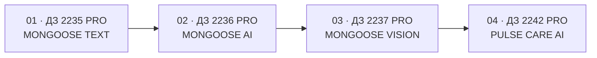

<div align="center">

# DEVELOPER OF AI AGENTS

### Единое инженерное портфолио курса

**Prompt Architecture · Dialogue AI · Multimodality · Web Agents · Safety · Reusable Knowledge**

[](#прогресс-курса)
[](#проекты-курса)
[](./00_STANDARDS/)
[](#текущий-этап)

**Один курс. Много самостоятельных проектов. Единая инженерная память.**

</div>

---

## О репозитории

Репозиторий объединяет практические работы курса «Разработчик AI-агентов».

Каждая папка в каталоге [`projects`](./projects/) является самостоятельным проектом со своими исходниками, README, документацией, demo-материалами и машиночитаемым манифестом.

Корневой README показывает:

- последовательность прохождения курса;
- статус каждого домашнего задания;
- освоенные технологии и архитектурные приёмы;
- повторно используемые компоненты;
- текущий этап и ближайшие задачи.

> **Принцип курса:** каждый новый проект остаётся самостоятельным продуктом, но использует знания и компоненты, накопленные в предыдущих работах.

---

## Прогресс курса

```text
Проектов зарегистрировано: 4
Завершено / Release Candidate: 1
Требуют финального оформления: 2
В активной разработке: 1
```



### Линия развития навыков

```text
Управление промптом
        ↓
Диалог и память
        ↓
Мультимодальность и действия
        ↓
Веб-агент с прогнозом и контекстом
        ↓
Следующие этапы курса
```

---

## Проекты курса

| № | ДЗ | Проект | Что демонстрирует | Статус |
|---:|---|---|---|---|
| 01 | 2235 PRO | [MONGOOSE TEXT](./projects/01-text-meaning-tone-editor/) | Сохранение смысла, управление целью, аудиторией и тональностью, structured output | Требует инвентаризации и финального отчёта |
| 02 | 2236 PRO | [MONGOOSE AI PLATFORM](./projects/02-dialogue-ai-assistant/) | Диалог, история, Workspace, Analysis Factory, Professional Assessment, PDF | Release Candidate |
| 03 | 2237 PRO | `MONGOOSE VISION` | Изображение + голос/текст + 3–5 кнопок дальнейших действий | Требует восстановления и доработки |
| 04 | 2242 PRO | [PULSE CARE AI](./projects/04-ai-fitness-trainer/) | Цели, дневник, детерминированный прогноз, AI-рекомендации, synthetic devices | В разработке |

Каждый проект развивается независимо и имеет собственный жизненный цикл.

---

## Проект 01 — MONGOOSE TEXT

**ДЗ 2235 PRO: редактор смыслов и тональности текста.**

Проект адаптирует исходный текст под:

- цель коммуникации;
- аудиторию;
- тональность;
- контекст использования;
- уровень формальности;
- желаемую длину;
- допустимость упрощения терминов.

Результат состоит из:

1. адаптированного текста;
2. нейтральной версии;
3. пояснения внесённых изменений.

Ключевая задача — изменить подачу без смыслового дрейфа.

[Открыть проект №01](./projects/01-text-meaning-tone-editor/)

---

## Проект 02 — MONGOOSE AI PLATFORM

**ДЗ 2236 PRO: диалоговый AI-ассистент с анализом истории и PDF.**

Реализованы:

- Dialogue Center;
- сохранение истории сообщений;
- отдельная аналитическая модель;
- структурированный результат;
- Professional Assessment;
- Workspace Lite;
- брендированные PDF-отчёты;
- инженерная документация и ADR.

[Открыть проект №02](./projects/02-dialogue-ai-assistant/)

---

## Проект 03 — MONGOOSE VISION

**ДЗ 2237 PRO: мультимодальное веб-приложение.**

Обязательный сценарий:

```text
Изображение
   +
Голос или текст
   ↓
Совместный анализ
   ↓
Основной ответ
   ↓
3–5 кнопок следующих действий
   ↓
Выполнение выбранного действия
```

Проект будет восстановлен как самостоятельная папка:

```text
projects/03-multimodal-action-assistant/
```

---

## Текущий этап

### Проект 04 — PULSE CARE AI

**ДЗ 2242 PRO: AI-фитнес-тренер с дневником и прогнозом достижения целей.**

Текущий проект должен:

- сохранять одну или несколько фитнес-целей;
- принимать исторические показатели;
- строить проверяемый математический прогноз;
- автоматически пересчитывать его после новых данных;
- объяснять динамику;
- формировать персонализированные рекомендации;
- использовать синтетические данные в demo;
- показывать каркас будущих интеграций с гаджетами.

[Открыть проект №04](./projects/04-ai-fitness-trainer/)

---

## Архитектурная эволюция

| Проект | Новый архитектурный слой | Что переиспользуем дальше |
|---|---|---|
| 01 · MONGOOSE TEXT | Prompt architecture, meaning guard, clarification cycles | Управляемые параметры, JSON-контракт, самопроверка |
| 02 · MONGOOSE AI | Dialogue API, Workspace, Analysis Factory, Report Factory | История, structured output, отчёты, трассировка |
| 03 · MONGOOSE VISION | Multimodal context, speech, action buttons | Обработка разных типов данных, action protocol |
| 04 · PULSE CARE AI | Goal engine, forecast service, safety rules, context events | Детерминированные расчёты, агентное планирование |

---

## Машиночитаемая инженерная память

```text
00_STANDARDS/
├── 00_KVS_ENGINEERING_STANDARD.yaml
├── 01_PROJECT_MANIFEST.schema.json
└── 02_AGENT_CONTEXT_PROTOCOL.md
```

Корневой файл [`course.manifest.yaml`](./course.manifest.yaml) регистрирует проекты и порядок чтения контекста.

Каждый проект содержит `project.manifest.yaml`, где фиксируются:

- требования задания;
- статус реализации;
- принятые решения;
- отсутствующие доказательства;
- повторно используемые компоненты;
- риски и ограничения;
- следующий шаг.

Таким образом, новый агент сначала изучает наработки курса, а затем предлагает изменения.

---

## Структура репозитория

```text
Developer-of-AI-agents/
├── 00_STANDARDS/
├── projects/
│   ├── 01-text-meaning-tone-editor/
│   ├── 02-dialogue-ai-assistant/
│   ├── 03-multimodal-action-assistant/
│   ├── 04-ai-fitness-trainer/
│   └── ...
├── course.manifest.yaml
├── README.md
└── LICENSE
```

Типовая структура самостоятельного проекта:

```text
project/
├── README.md
├── project.manifest.yaml
├── src/ или исходные модули
├── docs/
├── tests/
├── demo/
└── .env.example
```

---

## Общие инженерные принципы

1. **Independent projects** — каждый этап можно открыть и запустить отдельно.
2. **Reuse before rewrite** — сначала изучаются предыдущие реализации.
3. **Structured output** — важные AI-ответы имеют проверяемый контракт.
4. **Deterministic core** — расчёты выполняются кодом, LLM объясняет результат.
5. **Synthetic public demo** — реальные персональные данные не публикуются.
6. **Security by design** — секреты, доступ, журналы и ограничения проектируются заранее.
7. **Document every change** — существенные решения фиксируются в манифестах, журналах и ADR.

---

## Ближайший порядок работ

```text
01. Провести инвентаризацию исходников ДЗ 2235 PRO
02. Добавить ссылку, скриншоты и отчёт по проекту №01
03. Восстановить проект №03 и закрыть требования ДЗ 2237 PRO
04. Продолжить рабочий MVP проекта №04
05. После проверки объединить проекты в main
```

---

<div align="center">

**DEVELOPER OF AI AGENTS**

*One course. Independent projects. Shared engineering memory.*

</div>
