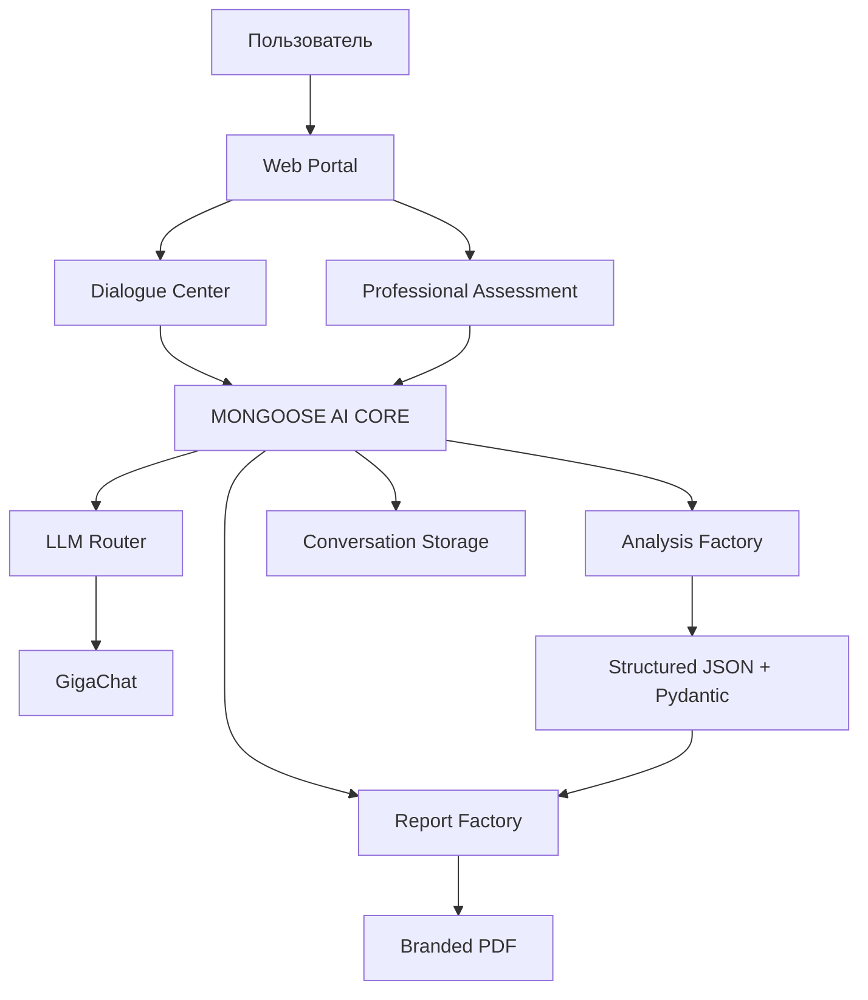
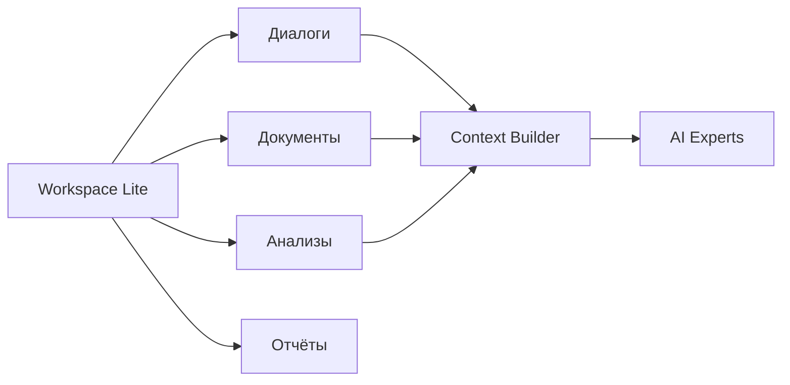
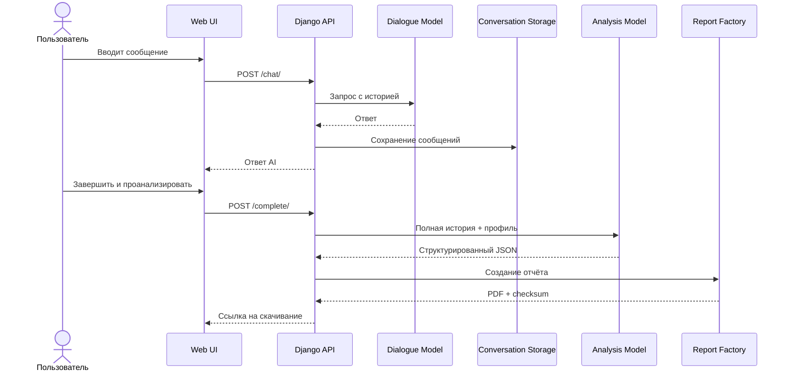
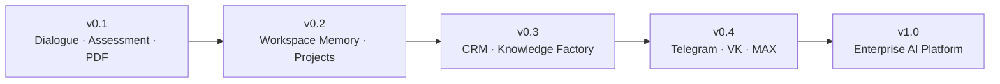

<div align="center">

# MONGOOSE AI PLATFORM

### One Workspace. Multiple AI Experts. Verifiable Results.

**Dialogue · Professional Assessment · Analysis Factory · Branded Reports**

[](#технологический-стек)
[](#технологический-стек)
[](#статус-проекта)
[](#безопасность)

**Учебный проект по ДЗ 2236 PRO, оформленный как основа модульной корпоративной AI-платформы.**

</div>

---

## О проекте

MONGOOSE AI PLATFORM — веб-платформа, в которой диалог, документы, аналитические профили и отчёты объединяются вокруг единого рабочего контекста.

Текущий релиз решает требования **ДЗ 2236 PRO**:

- ведёт полноценный диалог с AI;
- сохраняет историю сообщений;
- запускает отдельный аналитический промпт по всей истории;
- формирует структурированный результат;
- создаёт брендированный PDF;
- предоставляет итоговый отчёт для скачивания.

Проект развивается итерациями. Версия `v0.1` намеренно ограничена завершённым MVP: без преждевременного усложнения микросервисами, очередями и внешними каналами.

> **Ключевой принцип:** данные загружаются один раз, а разные AI-профили используют единый контекст для разных видов анализа.

---

## Что уже работает

### Dialogue Center

- премиальный веб-интерфейс;
- диалог через GigaChat;
- хранение истории в SQLite;
- correlation ID и централизованная трассировка;
- отдельное завершение диалога;
- выбор аналитического профиля;
- формирование PDF через ReportLab.

### Analysis Factory

В MVP доступны четыре профиля:

| Профиль | Назначение |
|---|---|
| Карьерный стратег | Сильные стороны, риски и ближайший карьерный маршрут |
| Карьерный наставник | Учебный план, проекты и контрольные точки |
| Проектный коуч | Приоритеты, этапы, ресурсы и риски проекта |
| Юнгианская рефлексия | Не-клиническая рефлексия мотивов, ценностей и архетипических тем |

Каждый профиль меняет аналитический промпт, но работает с одной и той же историей диалога.

### Professional Assessment

- загрузка `PDF`, `DOCX`, `TXT`;
- безопасное извлечение текста;
- ограничение размера файла;
- анализ сильных сторон;
- выявление пробелов;
- персональный трек развития;
- оценка готовности к целевой роли.

### Report Factory

- переносимый PDF на ReportLab;
- кириллица;
- брендирование;
- дата и идентификатор отчёта;
- аналитическое резюме;
- рекомендации;
- контрольная сумма;
- подготовка к расширению на другие форматы.

---

## Архитектура платформы



### Workspace First



В `v0.1` реализована облегчённая версия Workspace. Полноценная долговременная память и проекты вынесены в roadmap.

---

## Сценарий ДЗ 2236 PRO



---

## Быстрый запуск

### 1. Перейти в проект

```powershell
cd "G:\1\Developer of AI agents\Developer-of-AI-agents\projects\02-dialogue-ai-assistant"
```

### 2. Создать и активировать окружение

```powershell
python -m venv .venv
.\.venv\Scripts\Activate.ps1
```

### 3. Установить зависимости

```powershell
python -m pip install -r requirements.txt
```

### 4. Подготовить настройки

```powershell
Copy-Item .env.example .env
```

В `.env` укажите собственные credentials GigaChat:

```env
LLM_PROVIDER=gigachat
GIGACHAT_CREDENTIALS=
GIGACHAT_MODEL=GigaChat-2
GIGACHAT_SCOPE=GIGACHAT_API_PERS
```

### 5. Проверить и запустить

```powershell
python manage.py migrate
python manage.py check
python manage.py runserver
```

Открыть:

```text
http://127.0.0.1:8000/
```

Основные страницы:

```text
/chat/      Dialogue Center
/career/    Professional Assessment
/admin/     Django Administration
```

---

## Проверочный сценарий

1. Открыть `/chat/`.
2. Провести содержательный диалог.
3. Выбрать профиль анализа.
4. Нажать **«Завершить и проанализировать»**.
5. Скачать брендированный PDF.
6. Открыть `/career/`.
7. Загрузить синтетическое резюме в `PDF`, `DOCX` или `TXT`.
8. Построить профессиональный трек.

Для публичной демонстрации используйте только вымышленные данные.

---

## API

| Метод | Endpoint | Назначение |
|---|---|---|
| `GET` | `/api/v1/health/` | Проверка работоспособности |
| `POST` | `/api/v1/conversations/` | Создать диалог |
| `GET` | `/api/v1/conversations/{id}/` | Получить состояние |
| `POST` | `/api/v1/conversations/{id}/chat/` | Отправить сообщение |
| `POST` | `/api/v1/conversations/{id}/complete/` | Завершить диалог и запустить анализ |
| `GET` | `/api/v1/conversations/{id}/analysis/` | Получить результат анализа |
| `GET` | `/api/v1/conversations/{id}/report/` | Скачать PDF |

---

## Технологический стек

| Слой | Технологии |
|---|---|
| Backend | Python, Django, Django REST Framework |
| AI | GigaChat, Google GenAI-ready provider architecture |
| Validation | Pydantic |
| Reports | ReportLab |
| Documents | pypdf, python-docx |
| Storage | SQLite для MVP |
| Frontend | Django Templates, HTML, CSS, JavaScript |
| Testing | pytest, pytest-django |
| Quality | Ruff |

---

## Структура проекта

```text
02-dialogue-ai-assistant/
├── apps/
│   ├── analysis/          # аналитические профили и сервисы
│   ├── conversations/     # диалоги, сообщения и API
│   ├── reports/           # Report Factory и PDF renderer
│   └── web/               # страницы, Career Builder и web views
├── config/                # Django settings, urls, middleware
├── mongoose_core/         # порты, провайдеры и фабрики
├── static/                # branding, CSS, favicon
├── templates/             # premium UI и шаблоны отчётов
├── tests/                 # автоматические тесты
├── docs/                  # архитектура, ADR, журнал, roadmap
├── .env.example
├── manage.py
├── requirements.txt
└── README.md
```

---

## Безопасность

В MVP уже предусмотрены:

- секреты только через `.env`;
- запрет публикации API-ключей;
- CSRF-защита;
- correlation ID;
- журналы приложения, ошибок и security events;
- ограничение форматов и размера загружаемых файлов;
- обработка документов без исполнения содержимого;
- запрет реальных персональных данных в публичном demo;
- не-клинические ограничения для психологических профилей.

Логи:

```text
logs/application.log
logs/errors.log
logs/security.log
```

> Проект является учебным MVP и не должен использоваться как готовая система принятия кадровых, медицинских, юридических или иных высокорисковых решений.

---

## Инженерная документация

| Документ | Назначение |
|---|---|
| `docs/ARCHITECTURE.md` | Общая архитектура платформы |
| `docs/INVENTORY.md` | Инвентаризация веток и компонентов |
| `docs/MIGRATION_PLAN.md` | План объединения модулей |
| `docs/DEVELOPMENT_STANDARD.md` | Стандарт внесения изменений |
| `docs/PROJECT_JOURNAL.md` | История разработки с причинами решений |
| `docs/CHANGELOG.md` | История релизов |
| `docs/UNIFIED_WORKSPACE.md` | Единый контекст сообщений и документов |
| `docs/adr/` | Architecture Decision Records |
| `docs/design/DESIGN_SYSTEM.md` | Фирменная дизайн-система |

Каждое существенное изменение должно фиксироваться в журнале проекта. Архитектурные решения оформляются отдельными ADR.

---

## Статус проекта

### v0.1 Release Candidate

- [x] Premium Web Shell
- [x] Dialogue Center
- [x] GigaChat integration
- [x] Analysis Factory
- [x] ReportLab PDF
- [x] Professional Assessment
- [x] Document parsing
- [x] Development journal and ADR
- [ ] Workspace Lite shared context
- [ ] Synthetic Demo Mode
- [ ] Final screenshots
- [ ] Release tag `v0.1.0`

---

## Roadmap



В roadmap входят:

- проекты и возобновляемые сессии;
- долговременная память;
- CRM;
- RAG и Knowledge Factory;
- Telegram, VK, MAX и Email;
- Security Center;
- Agent Factory;
- PostgreSQL, Redis и очереди;
- Docker и CI/CD.

---

## Принципы проекта

1. **MVP first** — каждая версия должна быть законченной.
2. **Workspace first** — диалоги, документы, анализы и отчёты объединяются вокруг проекта.
3. **Verifiable AI** — AI-вывод должен быть связан с исходными данными.
4. **Security by design** — безопасность учитывается с первого прототипа.
5. **Document every change** — каждое изменение имеет дату, причину и результат.
6. **No personal data in public demo** — только синтетические персонажи и документы.

---

## Назначение репозитория

Проект создан как учебная работа, архитектурный прототип и портфельный пример разработки AI-приложения на Django.

Он демонстрирует:

- проектирование AI-сервисов;
- разделение диалоговой и аналитической моделей;
- structured output;
- provider abstraction;
- генерацию отчётов;
- безопасную обработку документов;
- развитие MVP в платформенную архитектуру;
- инженерную документацию и ADR.

---

<div align="center">

**MONGOOSE AI PLATFORM**

*One Workspace. Multiple AI Experts. Verifiable Results.*

</div>
