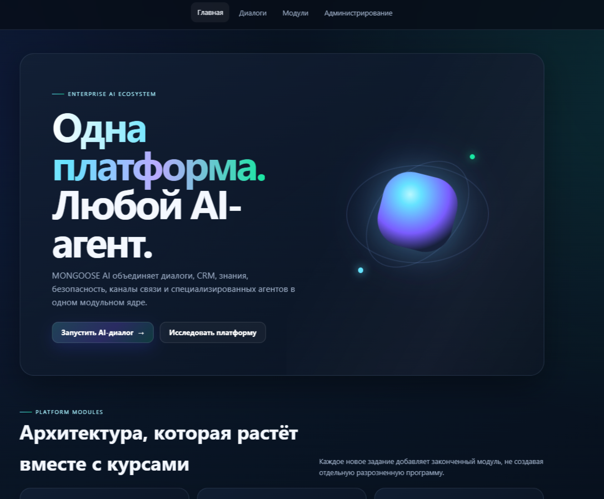
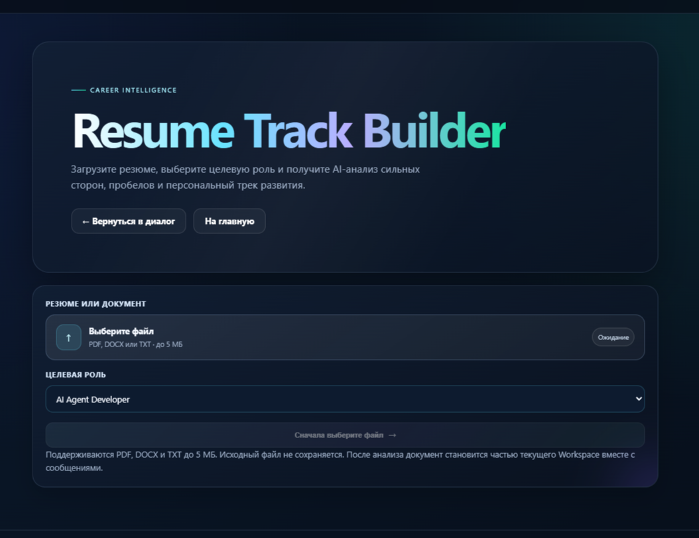
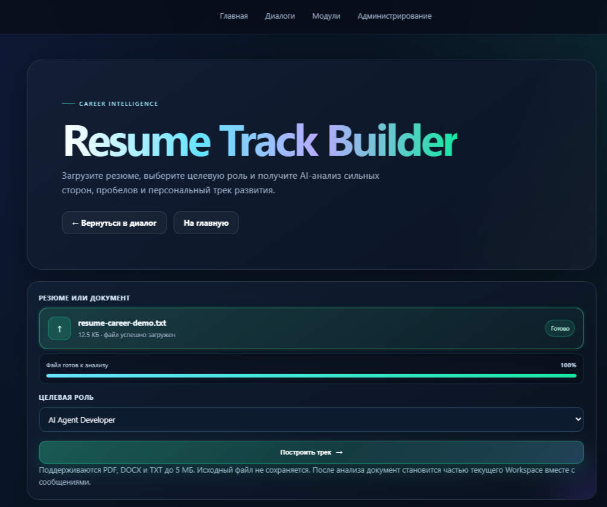
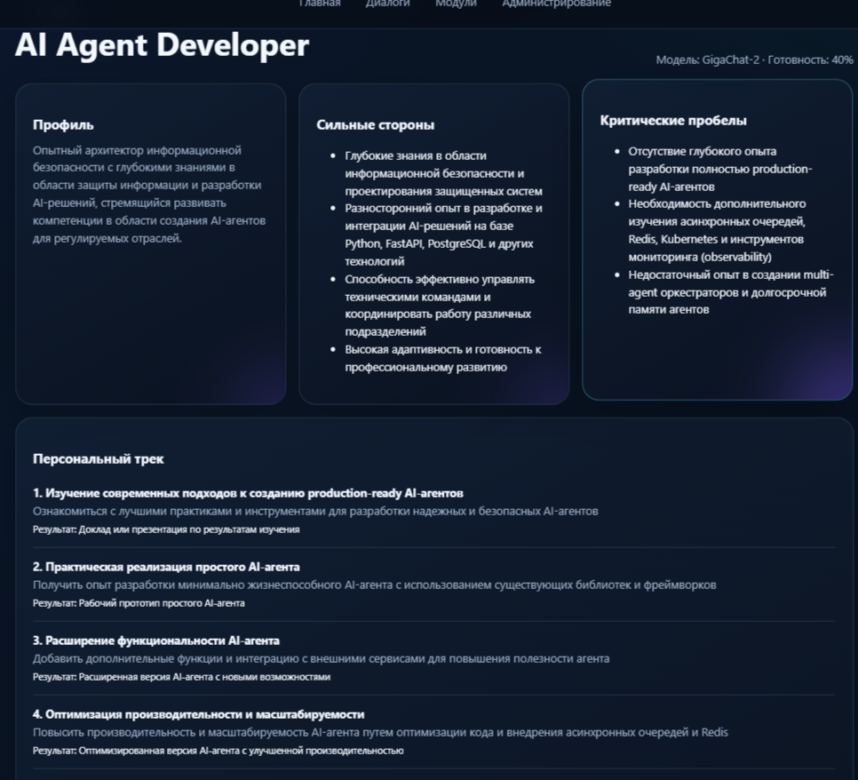
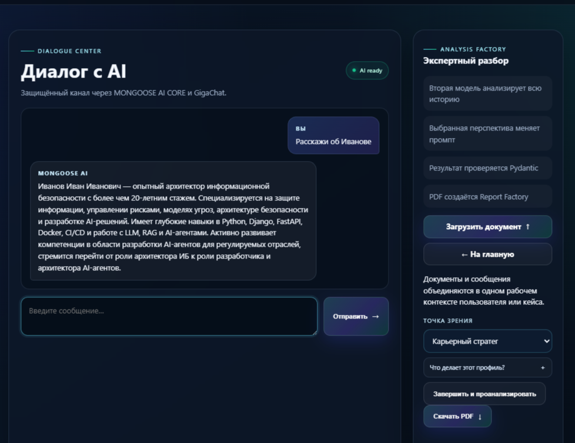
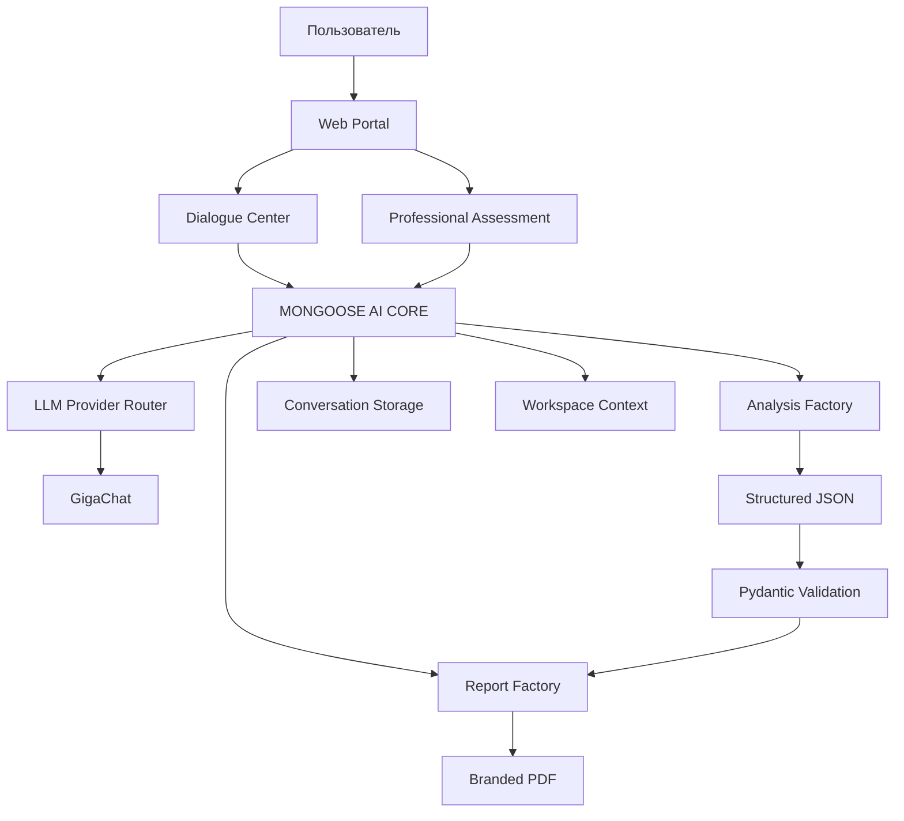
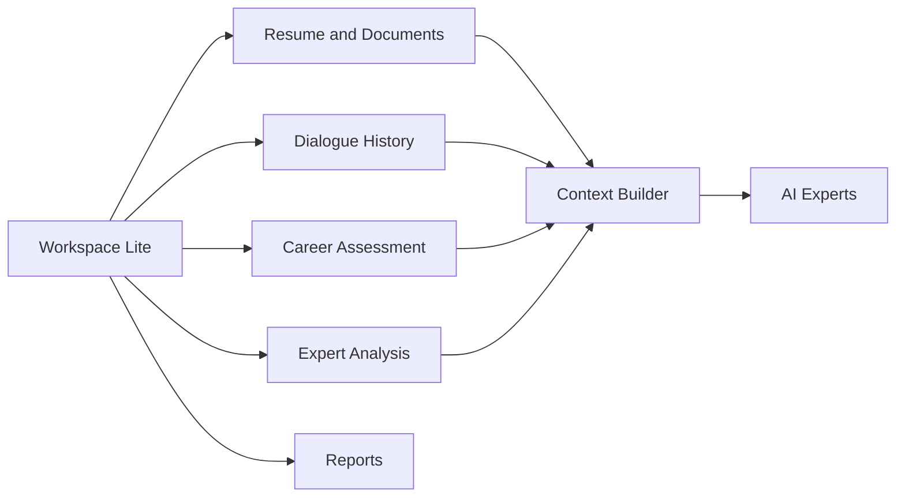
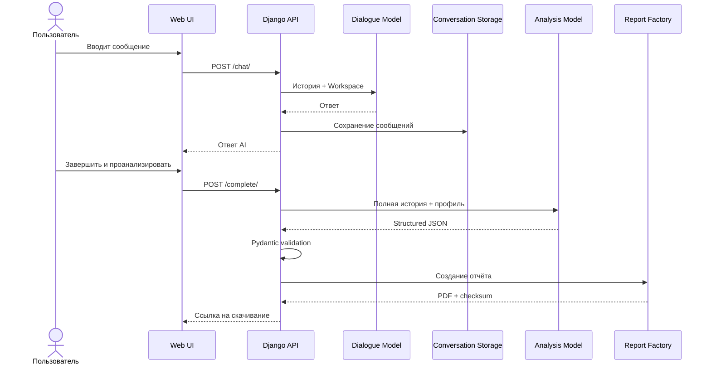
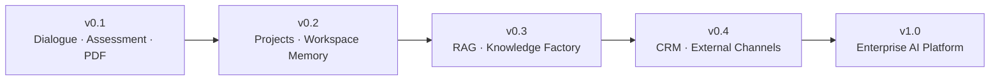

<div align="center">

# MONGOOSE AI PLATFORM

### One Workspace. Multiple AI Experts. Verifiable Results.

**Dialogue · Professional Assessment · Analysis Factory · Branded Reports**

[](#технологический-стек)
[](#технологический-стек)
[](#статус-проекта)
[](#безопасность)

**Учебный проект по ДЗ 2236 PRO, развёрнутый до модульного MVP корпоративной AI-платформы.**

</div>

---

## Платформа



**MONGOOSE AI PLATFORM** объединяет диалоги, документы, профессиональную оценку, экспертные AI-профили и PDF-отчёты вокруг единого рабочего контекста — **Workspace**.

Ключевой принцип проекта:

> Данные загружаются один раз, после чего разные AI-профили используют единый контекст для разных видов анализа.

### Что решает текущий релиз

- ведёт полноценный диалог с AI;
- сохраняет историю сообщений;
- использует загруженное резюме в общем Workspace;
- запускает отдельную аналитическую модель по всей истории;
- проверяет структурированный результат через Pydantic;
- формирует брендированные PDF-отчёты;
- поддерживает синтетический демонстрационный сценарий без публикации реальных персональных данных.

---

## Ключевые модули

| Модуль | Назначение |
|---|---|
| **Dialogue Center** | Диалог с AI на основе истории сообщений и контекста Workspace |
| **Professional Assessment** | Загрузка резюме и построение карьерного трека |
| **Analysis Factory** | Экспертный анализ истории с выбранной профессиональной точки зрения |
| **Report Factory** | Создание переносимых брендированных PDF-отчётов |
| **MONGOOSE AI CORE** | Провайдеры LLM, контракты, маршрутизация и общие сервисы |

---

# Product Walkthrough

## 1. Загрузка резюме



Модуль Professional Assessment принимает:

- `PDF`;
- `DOCX`;
- `TXT`;
- файлы размером до 5 МБ.

Документ извлекается безопасно, без исполнения содержимого. Исходный файл не сохраняется, а нормализованный текст становится частью текущего Workspace.

---

## 2. Документ готов к анализу



Интерфейс показывает:

- выбранный файл;
- размер документа;
- прогресс загрузки;
- статус готовности;
- целевую профессиональную роль;
- доступность кнопки запуска анализа.

---

## 3. Career Intelligence



AI формирует структурированную оценку:

- профиль кандидата;
- сильные стороны;
- переносимые компетенции;
- критические пробелы;
- рекомендуемые проекты;
- персональный трек развития;
- следующую контрольную точку;
- оценку готовности к целевой роли.

Результат проверяется Pydantic и используется для формирования PDF без повторного вызова модели.

---

## 4. Dialogue Center



Dialogue Center продолжает работу с уже накопленным контекстом. В одном сценарии объединяются:

- текст резюме;
- результат Professional Assessment;
- история сообщений;
- выбранный аналитический профиль;
- итоговый экспертный отчёт.

Это позволяет задавать вопросы вроде:

- «Дай общее резюме по кандидату»;
- «Какие у него сильные стороны?»;
- «Подходит ли он на целевую позицию?»;
- «Какие навыки развивать в ближайшие 90 дней?»

---

## 5. Analysis Factory

Analysis Factory запускает вторую аналитическую модель по полной истории диалога.

В MVP доступны четыре профиля:

| Профиль | Назначение |
|---|---|
| **Карьерный стратег** | Сильные стороны, риски и ближайший карьерный маршрут |
| **Карьерный наставник** | Учебный план, проекты и контрольные точки |
| **Проектный коуч** | Приоритеты, этапы, ресурсы и риски проекта |
| **Юнгианская рефлексия** | Не-клиническая рефлексия мотивов, ценностей и архетипических тем |

Каждый профиль меняет аналитический промпт, но использует одну и ту же историю диалога.

### Надёжность structured output

Для нестабильных ответов LLM реализованы:

- извлечение первого завершённого JSON-объекта;
- проверка обязательных верхнеуровневых полей;
- нормализация строк, списков и рекомендаций;
- повторная генерация при частичном или повреждённом JSON;
- итоговая проверка через Pydantic;
- диагностические логи основной и repair-попытки.

---

# Demo Assets

Все материалы демонстрации используют вымышленные данные.

## Синтетическое резюме

- [Открыть полное демо-резюме Иванова Ивана Ивановича](demo/personas/ivanov-ivan/resume.txt)
- [Открыть карьерную демо-версию резюме](demo/personas/ivanov-ivan/resume-career-demo.txt)
- [Описание синтетического персонажа](demo/personas/ivanov-ivan/README.md)

## Готовые PDF-отчёты

- [AI Resume Assessment Report](docs/reports/ai-resume-assessment-demo.pdf) — анализ резюме и персональный карьерный маршрут;
- [AI Candidate Assessment Report](docs/reports/ai-candidate-assessment-demo.pdf) — анализ резюме, диалога и рекомендаций по развитию.

## Скриншоты

| № | Экран | Файл |
|---|---|---|
| 1 | Главная панель платформы | [`01-home-dashboard.png`](docs/screenshots/01-home-dashboard.png) |
| 2 | Загрузка резюме | [`02-career-upload.png`](docs/screenshots/02-career-upload.png) |
| 3 | Файл готов к анализу | [`03-career-upload-ready.png`](docs/screenshots/03-career-upload-ready.png) |
| 4 | Готовый карьерный анализ | [`04-career-analysis-result.png`](docs/screenshots/04-career-analysis-result.png) |
| 5 | Dialogue Center и Analysis Factory | [`05-dialogue-center.png`](docs/screenshots/05-dialogue-center.png) |

---

# Архитектура платформы



## Workspace First



В `v0.1` реализован Workspace Lite на уровне пользовательской сессии и связанных сущностей. Проекты, долговременная память и полноценное RAG-хранилище вынесены в roadmap.

---

# Сценарий ДЗ 2236 PRO



---

# Быстрый запуск

## 1. Перейти в проект

```powershell
cd "G:\1\Developer of AI agents\Developer-of-AI-agents\projects\02-dialogue-ai-assistant"
```

## 2. Создать и активировать окружение

```powershell
python -m venv .venv
.\.venv\Scripts\Activate.ps1
```

## 3. Установить зависимости

```powershell
python -m pip install -r requirements.txt
```

## 4. Подготовить настройки

```powershell
Copy-Item .env.example .env
```

В `.env` укажите собственные credentials GigaChat:

```env
LLM_PROVIDER=gigachat
GIGACHAT_CREDENTIALS=
GIGACHAT_MODEL=GigaChat-2
GIGACHAT_SCOPE=GIGACHAT_API_PERS
```

## 5. Подготовить базу и запустить сервер

```powershell
python manage.py migrate
python manage.py check
python manage.py runserver
```

Открыть:

```text
http://127.0.0.1:8000/
```

Основные страницы:

| Страница | Назначение |
|---|---|
| `/` | Главная панель платформы |
| `/chat/` | Dialogue Center и Analysis Factory |
| `/career/` | Professional Assessment |
| `/admin/` | Django Administration |

---

# Демонстрационный сценарий

1. Открыть `/career/`.
2. Загрузить `demo/personas/ivanov-ivan/resume-career-demo.txt`.
3. Выбрать целевую роль `AI Agent Developer`.
4. Построить карьерный трек.
5. Скачать Career PDF.
6. Перейти в Dialogue Center.
7. Задать вопрос о кандидате.
8. Выбрать профиль «Карьерный стратег».
9. Нажать «Завершить и проанализировать».
10. Скачать итоговый Candidate PDF.

> Для публичной демонстрации используйте только синтетические данные.

---

# API

| Метод | Endpoint | Назначение |
|---|---|---|
| `GET` | `/api/v1/health/` | Проверка работоспособности |
| `POST` | `/api/v1/conversations/` | Создать диалог |
| `GET` | `/api/v1/conversations/{id}/` | Получить состояние диалога |
| `POST` | `/api/v1/conversations/{id}/chat/` | Отправить сообщение |
| `POST` | `/api/v1/conversations/{id}/complete/` | Завершить диалог и запустить анализ |
| `GET` | `/api/v1/conversations/{id}/analysis/` | Получить результат анализа |
| `GET` | `/api/v1/conversations/{id}/report/` | Скачать Dialogue PDF |
| `GET` | `/career/report/` | Скачать Career PDF текущей сессии |

---

# Технологический стек

| Слой | Технологии |
|---|---|
| Backend | Python, Django, Django REST Framework |
| AI | GigaChat, provider abstraction |
| Validation | Pydantic |
| Reports | ReportLab |
| Documents | pypdf, python-docx |
| Storage | SQLite для MVP |
| Frontend | Django Templates, HTML, CSS, JavaScript |
| Testing | pytest, pytest-django |
| Quality | Ruff |
| Observability | Correlation ID, structured application and error logs |

---

# Структура проекта

```text
02-dialogue-ai-assistant/
├── apps/
│   ├── analysis/              # профили, structured output и аналитические сервисы
│   ├── conversations/         # диалоги, сообщения и REST API
│   ├── reports/               # Report Factory и PDF renderer
│   └── web/                   # страницы, Career Builder и web views
├── config/                    # settings, urls и middleware
├── mongoose_core/             # порты, провайдеры и фабрики
├── demo/
│   └── personas/
│       └── ivanov-ivan/       # синтетическое резюме и описание персонажа
├── docs/
│   ├── screenshots/           # скриншоты пользовательского сценария
│   ├── reports/               # демонстрационные PDF
│   ├── adr/                   # Architecture Decision Records
│   └── design/                # дизайн-система
├── static/                    # branding, CSS, JavaScript и favicon
├── templates/                 # интерфейсы платформы
├── tests/                     # автоматические тесты
├── .env.example
├── manage.py
├── requirements.txt
└── README.md
```

---

# Безопасность

В MVP предусмотрены:

- хранение секретов только через `.env`;
- запрет публикации API-ключей;
- CSRF-защита;
- correlation ID для запросов;
- журналы приложения, ошибок и security events;
- ограничение типов и размера загружаемых файлов;
- обработка документов без исполнения содержимого;
- повторная проверка structured output;
- запрет реальных персональных данных в публичном demo;
- не-клинические ограничения психологических профилей.

Логи:

```text
logs/application.log
logs/errors.log
logs/security.log
```

> Проект является учебным MVP и не должен использоваться как готовая система принятия кадровых, медицинских, юридических или иных высокорисковых решений.

---

# Инженерная документация

| Документ | Назначение |
|---|---|
| [`docs/ARCHITECTURE.md`](docs/ARCHITECTURE.md) | Общая архитектура платформы |
| [`docs/INVENTORY.md`](docs/INVENTORY.md) | Инвентаризация компонентов |
| [`docs/MIGRATION_PLAN.md`](docs/MIGRATION_PLAN.md) | План объединения модулей |
| [`docs/DEVELOPMENT_STANDARD.md`](docs/DEVELOPMENT_STANDARD.md) | Стандарт внесения изменений |
| [`docs/PROJECT_JOURNAL.md`](docs/PROJECT_JOURNAL.md) | История разработки и причины решений |
| [`docs/CHANGELOG.md`](docs/CHANGELOG.md) | История изменений |
| [`docs/UNIFIED_WORKSPACE.md`](docs/UNIFIED_WORKSPACE.md) | Единый контекст сообщений и документов |
| [`docs/adr/`](docs/adr/) | Architecture Decision Records |
| [`docs/design/DESIGN_SYSTEM.md`](docs/design/DESIGN_SYSTEM.md) | Фирменная дизайн-система |

Каждое существенное изменение фиксируется в журнале проекта. Архитектурные решения оформляются отдельными ADR.

---

# Статус проекта

## v0.1 Release Candidate

- [x] Premium Web Shell
- [x] Dialogue Center
- [x] GigaChat integration
- [x] Analysis Factory
- [x] Structured output validation
- [x] ReportLab PDF
- [x] Professional Assessment
- [x] Document parsing
- [x] Workspace Lite shared context
- [x] Synthetic Demo Mode
- [x] Final screenshots
- [x] Demonstration PDF reports
- [x] Development journal and ADR
- [ ] Release tag `v0.1.0`

---

# Roadmap



В roadmap входят:

- проекты и возобновляемые сессии;
- долговременная память;
- RAG и Knowledge Factory;
- PostgreSQL и векторное хранилище;
- Redis и очереди задач;
- CRM;
- Telegram, VK, MAX и Email;
- Security Center;
- Agent Factory;
- Docker и CI/CD;
- корпоративная панель аналитики.

---

# Принципы проекта

1. **MVP first** — каждая версия должна быть законченной.
2. **Workspace first** — диалоги, документы, анализы и отчёты объединяются вокруг одного контекста.
3. **Verifiable AI** — вывод модели должен быть связан с исходными данными и проверяемой структурой.
4. **Security by design** — безопасность учитывается с первого прототипа.
5. **Document every change** — каждое существенное изменение имеет дату, причину и результат.
6. **No personal data in public demo** — только синтетические персонажи и документы.

---

# Назначение репозитория

Проект создан одновременно как:

- учебная работа по ДЗ 2236 PRO;
- архитектурный прототип AI-платформы;
- портфельный пример Django-приложения;
- демонстрация provider abstraction и structured output;
- пример безопасной обработки документов;
- основа для дальнейшего развития AI-агентов, RAG и корпоративного Workspace.

Он демонстрирует:

- проектирование AI-сервисов;
- разделение диалоговой и аналитической моделей;
- единый контекст документов и сообщений;
- structured output и Pydantic;
- восстановление нестабильных ответов LLM;
- генерацию профессиональных PDF;
- инженерную документацию и ADR;
- развитие законченного MVP в платформенную архитектуру.

---

<div align="center">

## MONGOOSE AI PLATFORM

**One Workspace. Multiple AI Experts. Verifiable Results.**

</div>
