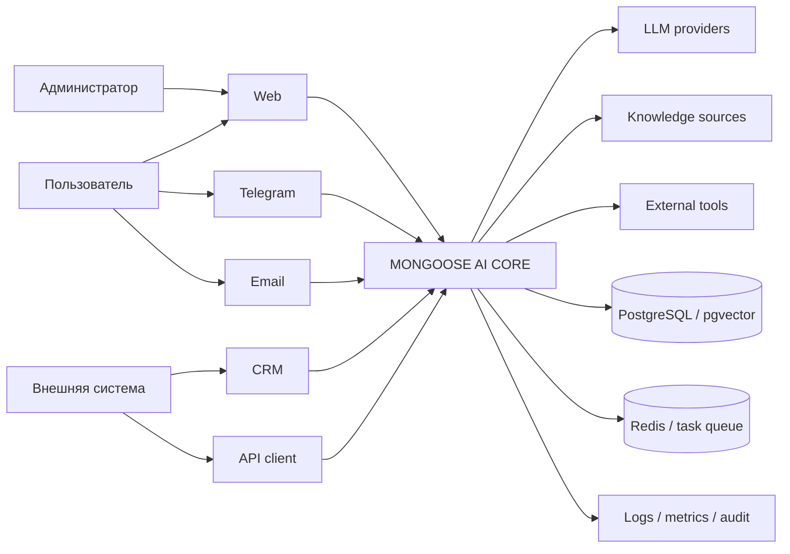
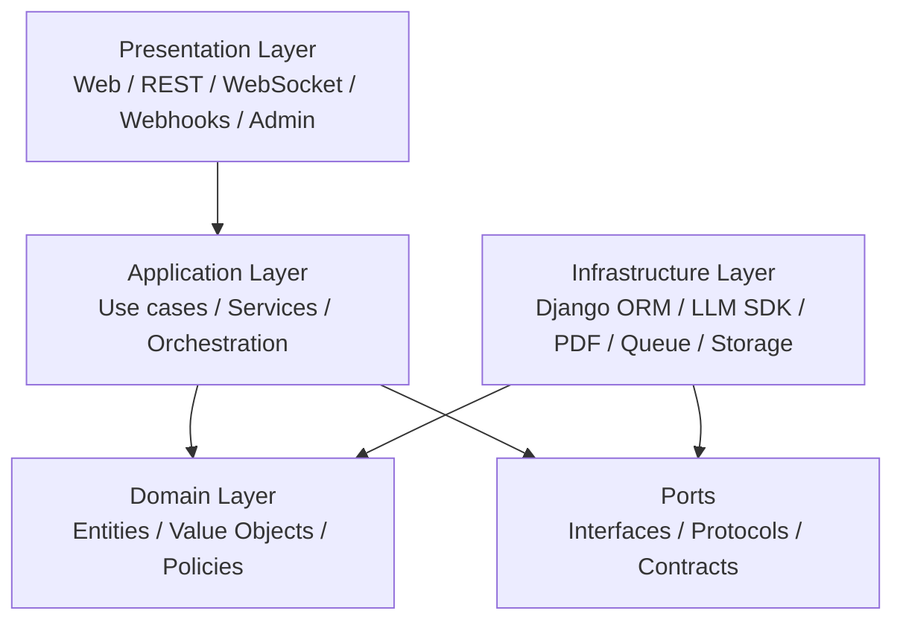
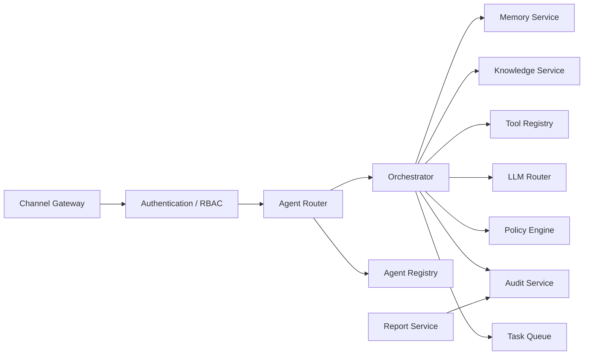
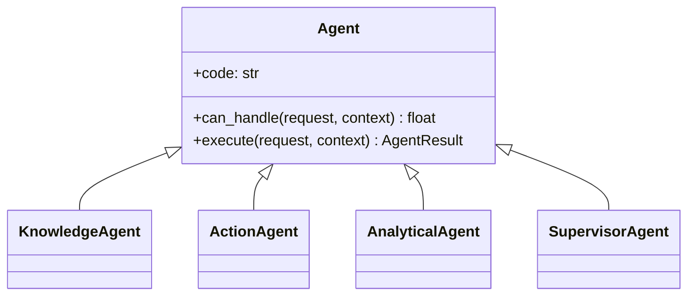
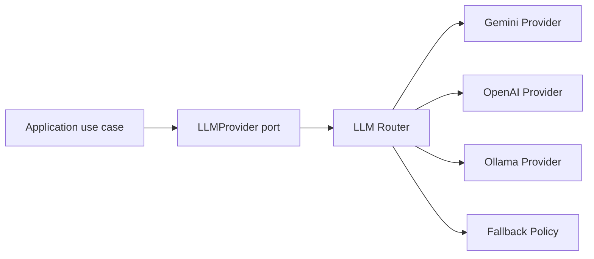
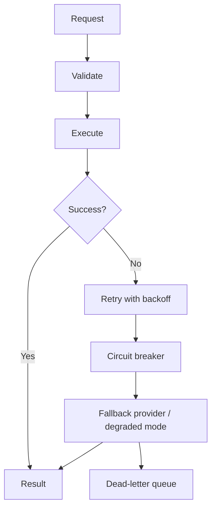
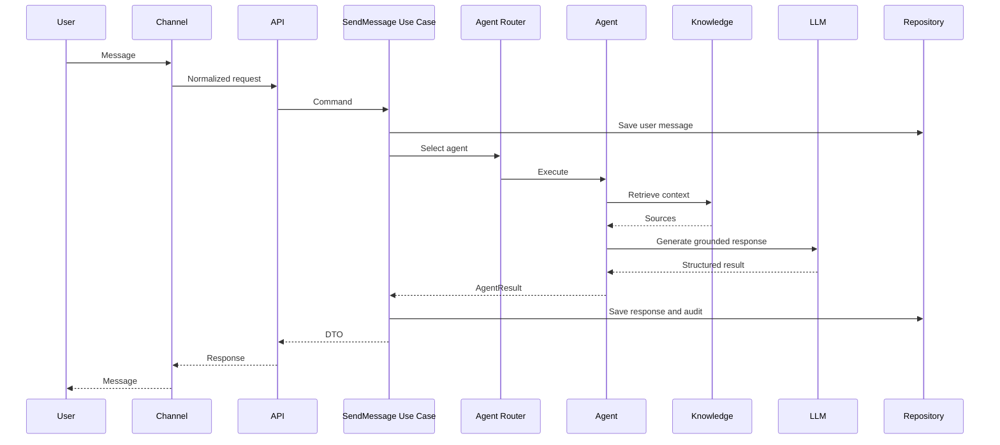
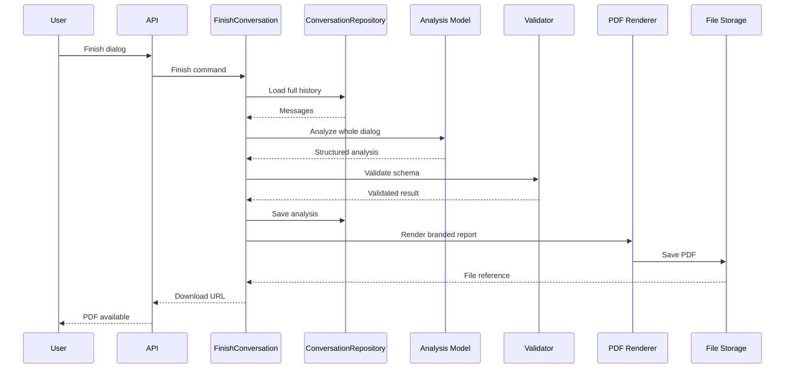

# Архитектура MONGOOSE AI CORE

## 1. Назначение

MONGOOSE AI CORE — универсальная многоканальная платформа AI-агентов на Django.

Платформа должна позволять подключать новые каналы, LLM-провайдеры, базы знаний, инструменты и специализированных агентов без переписывания общего ядра.

Ключевые свойства:

- API-first;
- multi-channel;
- модульность;
- заменяемость провайдеров;
- отказоустойчивость;
- наблюдаемость;
- безопасность по умолчанию;
- единая база знаний;
- единая память;
- единый аудит действий.

## 2. Архитектурные цели

### 2.1. Живучесть

Отказ отдельного канала, внешней LLM или инструмента не должен останавливать всю систему.

### 2.2. Точность

Система должна разделять факты, выводы, допущения и уровень уверенности. Ответы на основании базы знаний должны сопровождаться источниками.

### 2.3. Скорость

Простые запросы должны проходить короткий маршрут, тяжёлые операции — выполняться асинхронно, а повторные запросы — использовать кеш.

### 2.4. Расширяемость

Новый агент должен подключаться через контракт, а не через изменение существующего ядра.

## 3. Контекст системы



## 4. Логическая архитектура



Главное правило зависимостей:

> Внутренние слои не зависят от внешних.

Это означает:

- Domain не импортирует Django, DRF, Gemini SDK, Redis или WeasyPrint;
- Application знает контракты, но не конкретные SDK;
- Infrastructure реализует контракты;
- Presentation вызывает сценарии Application и не содержит бизнес-логику.

## 5. Слои

### 5.1. Presentation Layer

Содержит:

- Django views;
- DRF serializers;
- REST endpoints;
- WebSocket consumers;
- webhooks;
- Django Admin;
- HTML templates.

Ответственность:

- принять запрос;
- проверить формат;
- передать данные в use case;
- вернуть HTTP/WebSocket-ответ.

Не допускается:

- прямой вызов Gemini/OpenAI SDK;
- построение PDF;
- сложная бизнес-логика;
- прямое управление транзакциями нескольких модулей.

### 5.2. Application Layer

Содержит сценарии использования:

- StartConversation;
- SendMessage;
- FinishConversation;
- AnalyzeConversation;
- GenerateReport;
- SearchKnowledge;
- ExecuteAgentTask.

Ответственность:

- координация компонентов;
- управление шагами сценария;
- работа через интерфейсы;
- контроль транзакций;
- обработка прикладных ошибок.

### 5.3. Domain Layer

Содержит чистую предметную модель:

- Conversation;
- Message;
- Agent;
- AgentTask;
- UserProfile;
- AnalysisResult;
- KnowledgeReference;
- Report;
- PolicyDecision.

Domain не должен зависеть от Django ORM. Django-модели являются инфраструктурным отображением доменных сущностей.

### 5.4. Ports

Порты — это контракты между Application и Infrastructure.

Основные интерфейсы:

- LLMProvider;
- ConversationRepository;
- KnowledgeRepository;
- MemoryStore;
- Tool;
- Agent;
- ReportRenderer;
- EventPublisher;
- AuditWriter;
- Clock;
- IdentifierGenerator.

### 5.5. Infrastructure Layer

Содержит конкретные реализации:

- DjangoConversationRepository;
- GeminiProvider;
- OpenAIProvider;
- PgVectorKnowledgeRepository;
- RedisMemoryStore;
- WeasyPrintReportRenderer;
- CeleryTaskDispatcher;
- DjangoAuditWriter.

## 6. Компонентная архитектура



## 7. Каналы связи

Каждый канал преобразует внешний запрос в единый объект.

```text
IncomingMessage
├── channel
├── external_user_id
├── conversation_id
├── text
├── attachments
├── received_at
└── metadata
```

Контракт канала:

```python
class ChannelAdapter(Protocol):
    def normalize(self, payload: object) -> IncomingMessage: ...
    async def send(self, recipient: str, message: OutgoingMessage) -> None: ...
```

Каналы:

- Web;
- Telegram;
- Email;
- CRM;
- REST API;
- WebSocket;
- будущие мобильные и голосовые интерфейсы.

## 8. Архитектура агентов



При этом способности агента подключаются преимущественно композицией:

- knowledge service;
- memory service;
- tool registry;
- policy engine;
- LLM provider;
- report service.

Наследование используется только для устойчивых отношений «является».

## 9. LLM-архитектура

Приложение не вызывает SDK конкретной модели напрямую.



LLMProvider должен поддерживать:

- text generation;
- structured output;
- token usage;
- timeout;
- retry policy;
- model metadata;
- safety result;
- provider errors.

## 10. База знаний

База знаний является обязательным компонентом платформы.

```mermaid
flowchart LR
    Source[Document / API / Database]
    Ingest[Ingestion]
    Parse[Parsing]
    Chunk[Chunking]
    Metadata[Metadata extraction]
    Embed[Embeddings]
    Index[Indexing]
    Search[Hybrid search]
    Rerank[Reranking]
    Answer[Grounded answer]

    Source --> Ingest --> Parse --> Chunk --> Metadata --> Embed --> Index
    Index --> Search --> Rerank --> Answer
```



Уровни знаний:

1. Общая база платформы.
2. Предметная база агента.
3. База организации.
4. База проекта.
5. Личная область пользователя.

Доступ определяется политиками и tenant scope.

## 11. Память

Память разделяется на:

- conversation history;
- working memory;
- user profile;
- long-term memory;
- task state.

База знаний отвечает на вопрос «что известно миру и организации», память — «что известно о текущем пользователе и текущей работе».

## 12. Инструменты

Каждый инструмент реализует единый контракт.

```python
class Tool(Protocol):
    name: str
    async def execute(self, input_data: dict, context: ToolContext) -> ToolResult: ...
```

Для каждого инструмента задаются:

- схема входа;
- схема выхода;
- разрешённые роли;
- уровень риска;
- необходимость подтверждения;
- timeout;
- idempotency policy;
- audit policy.

## 13. Безопасность

Безопасность является сквозным слоем.

Обязательные элементы:

- authentication;
- RBAC/ABAC;
- tenant isolation;
- secret management;
- prompt injection protection;
- tool allowlist;
- input/output validation;
- human confirmation для опасных действий;
- audit log;
- rate limiting;
- PII handling;
- data retention policies.

Критичные операции не выполняются только на основании текста LLM.

## 14. Надёжность и живучесть



Механизмы:

- retries with exponential backoff;
- timeout;
- circuit breaker;
- idempotency keys;
- dead-letter queue;
- fallback provider;
- degraded mode;
- health checks;
- transaction boundaries;
- outbox pattern для событий.

## 15. Наблюдаемость

Система должна собирать:

- application logs;
- audit logs;
- metrics;
- traces;
- LLM token usage;
- latency;
- tool calls;
- error rates;
- provider availability;
- retrieval quality.

Каждый запрос получает correlation_id.

## 16. Поток обычного сообщения



## 17. Поток завершения диалога и PDF



## 18. Целевая структура проекта

```text
projects/02-dialogue-ai-assistant/
├── config/                     # Django configuration
├── apps/                       # Django infrastructure apps
│   ├── conversations/
│   ├── analysis/
│   ├── reports/
│   ├── knowledge/
│   ├── agents/
│   ├── audit/
│   └── accounts/
├── mongoose_core/
│   ├── domain/                 # Pure domain model
│   ├── application/            # Use cases
│   ├── ports/                  # Interfaces and protocols
│   ├── agents/                 # Agent abstractions and registry
│   ├── orchestration/          # Planner and coordinator
│   ├── policies/               # Security and business rules
│   └── events/                 # Domain/application events
├── infrastructure/
│   ├── llm/
│   ├── persistence/
│   ├── knowledge/
│   ├── memory/
│   ├── tools/
│   ├── reports/
│   ├── queue/
│   └── observability/
├── presentation/
│   ├── api/
│   ├── web/
│   ├── websocket/
│   └── admin/
├── templates/
├── static/
├── tests/
│   ├── unit/
│   ├── integration/
│   ├── contract/
│   └── e2e/
├── docs/
├── docker/
└── manage.py
```

## 19. Правила зависимостей

Разрешено:

```text
presentation -> application
application -> domain
application -> ports
infrastructure -> ports
infrastructure -> domain
config -> все слои только для сборки приложения
```

Запрещено:

```text
domain -> Django
application -> Gemini SDK
application -> WeasyPrint
application -> Redis client
presentation -> ORM напрямую для сложных сценариев
infrastructure -> presentation
```

## 20. Правила разработки

1. Бизнес-логика не размещается во views и serializers.
2. Прямые вызовы внешних SDK разрешены только в infrastructure.
3. Каждый внешний сервис скрыт за интерфейсом.
4. Каждый критичный сценарий имеет use case.
5. Каждый агент имеет паспорт и контракт.
6. База знаний обязательна для knowledge-based агентов.
7. Действия с побочными эффектами аудируются.
8. Опасные операции требуют policy check и при необходимости human confirmation.
9. Структурированные ответы LLM валидируются схемой.
10. Ошибки провайдера не должны раскрывать секреты пользователю.
11. Все публичные API версионируются.
12. Все фоновые задачи идемпотентны.
13. Новая функциональность сопровождается тестами.
14. Новое архитектурное решение оформляется ADR.

## 21. Этапы реализации

### Этап A. Foundation

- domain primitives;
- ports;
- LLMProvider;
- Agent;
- repositories;
- use cases;
- dependency wiring.

### Этап B. Homework 2236 PRO

- web dialog;
- Gemini dialogue provider;
- second analytical prompt;
- structured validation;
- branded PDF;
- download endpoint.

### Этап C. Knowledge Core

- ingestion;
- chunking;
- pgvector;
- hybrid retrieval;
- citations;
- access scopes.

### Этап D. Multi-channel

- Telegram;
- WebSocket;
- Email;
- CRM/webhooks.

### Этап E. Enterprise resilience

- Redis;
- Celery;
- retry/circuit breaker;
- monitoring;
- audit;
- Docker and CI/CD.

## 22. Главный архитектурный принцип

> Новый агент подключается к платформе как модуль и получает API, каналы, память, знания, инструменты, безопасность, мониторинг и отказоустойчивость от общего ядра.
